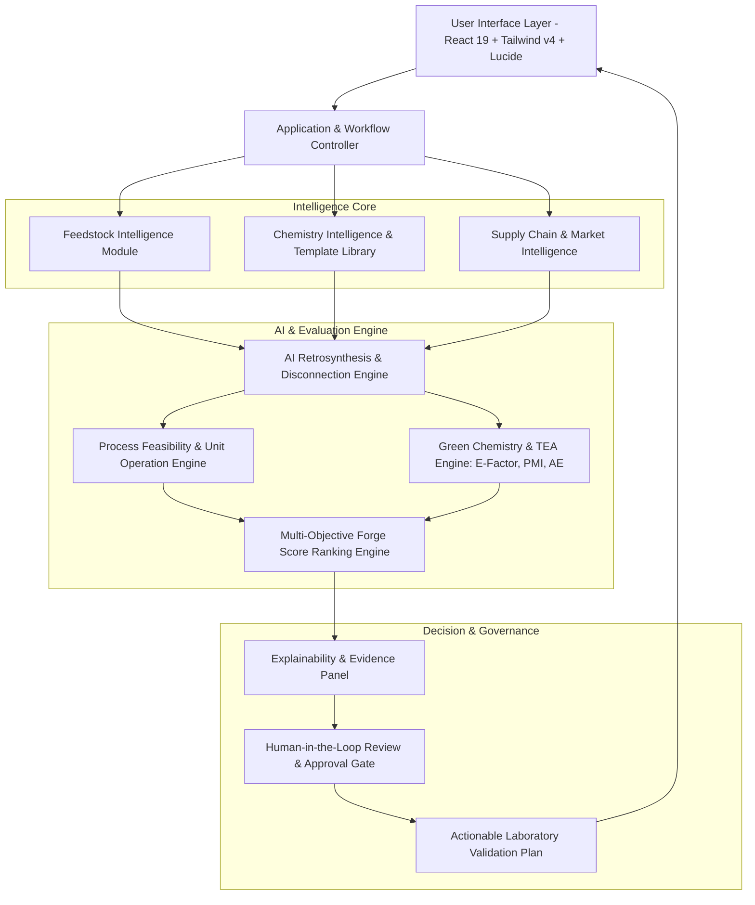

# ⚛️ Molecule Forge
### *From Refinery Feedstock to High-Value Molecule — Before the First Experiment Begins*

[](https://vercel.com)
[](https://vitejs.dev/)
[](https://react.dev/)
[](https://www.typescriptlang.org/)
[](https://tailwindcss.com/)
[](#-green-chemistry--process-feasibility-module)
[](#-responsible-positioning--safeguards)

---

## 📌 Executive Summary

**Molecule Forge** is an AI-powered chemical route-discovery and process-screening platform that identifies commercially promising molecules from refinery aromatics (such as benzene, phenol, toluene, and xylene) and then designs, compares, and ranks practical, sustainable synthesis routes for producing them.

> **Core Philosophy:**
> Molecule Forge **does not replace chemists** or guarantee autonomous reaction success. Rather, it acts as **"Google Maps for Chemical Manufacturing Routes"** — calculating trade-offs across cost, sustainability, raw-material availability, and scale-up risks to guide researchers toward high-potential opportunities before committing laboratory time and plant resources.

```
       [ Refinery Feedstock ]
    (Benzene, Toluene, Xylene)
                │
                ▼
  ┌───────────────────────────┐
  │      MOLECULE FORGE       │  ◄── AI Retrosynthesis + Multi-Attribute
  │      Decision Engine      │      Decision Matrix (Forge Score)
  └─────────────┬─────────────┘
                │
    ┌───────────┼───────────┐
    ▼           ▼           ▼
[Route A]   [Route B]   [Route C]
 Shortest    Greenest    Highest Local Sourcing
 (3 Steps)  ★ (81/100)   (Domestic 92%)
    │           │           │
    └───────────┼───────────┘
                ▼
   [ Actionable Lab Validation Plan ]
   (Risk gates, conversion targets, & TEA)
```

---

## 🛑 The Industrial Problem

A modern refinery does not produce only fuels. Its streams contain foundational chemical building blocks, particularly aromatics. However, converting these streams into high-margin specialty chemicals, Key Starting Materials (KSMs), or Active Pharmaceutical Ingredient (API) intermediates requires solving complex, interconnected problems:

```
┌─────────────────┐       ┌──────────────────────┐       ┌──────────────────────┐
│ R&D / Chemistry │       │  Process Engineering │       │ Supply Chain / SCM   │
│ Can we synthesize│ ───►  │ Can we scale it up   │ ───►  │ Are raw materials    │
│ this molecule?  │       │ without high hazards?│       │ locally available?   │
└─────────────────┘       └──────────────────────┘       └──────────────────────┘
                                                                    │
                                                                    ▼
                                                         ┌──────────────────────┐
                                                         │ Business Development │
                                                         │ Is the gross margin  │
                                                         │ commercially viable? │
                                                         └──────────────────────┘
```

### The Cost of Sequential Silos
Currently, these evaluations happen **sequentially across isolated departments**:
1. A **chemist** designs a synthetically elegant 3-step route in the literature.
2. A **process engineer** discovers months later that step 2 requires cryogenic cooling or high-pressure autogenous conditions (>60 bar).
3. A **procurement team** finds that the primary coupling reagent is subject to a 90% import dependence or unstable overseas tariffs.
4. A **sustainability team** flags that the route produces an unacceptable E-factor (>40 kg waste/kg product) with severe cyanide or heavy metal effluent liabilities.

**Result:** Months of costly laboratory work are wasted on routes that fail basic commercial, environmental, or operational gates.

---

## 💡 The Solution: 5 Integrated Pillars

Molecule Forge breaks departmental silos by combining five core analytical capabilities into a unified digital decision platform:

| Pillar | Capability | What It Solves |
|---|---|---|
| **1. Feedstock Intelligence Layer** | Digital mapping of refinery aromatics (benzene, phenol, toluene, xylenes, sulphur, hexane). | Connects raw refinery streams directly to real-world industrial downstream derivatives. |
| **2. Target-Product & Retrosynthesis** | Dual-mode discovery (Feedstock-First & Target-First) with rule-constrained disconnections. | Prevents synthetic hallucination by pairing template constraints with reaction precedents. |
| **3. Green Chemistry & Process Feasibility** | Real-time calculation of E-Factor, PMI, Atom Economy, and solvent toxicity profiles. | Prevents environmental failure modes before the first lab experiment is performed. |
| **4. Supply Chain & Commercial Screening** | Evaluates domestic supplier reliability, import dependence, and reagent procurement risks. | Shields industrial scale-up against geopolitical and logistics disruptions. |
| **5. Explainable Decision Support** | Multi-attribute decision matrix producing an overall **Forge Score** with uncertainty boundaries. | Gives chemists, engineers, and executives clear transparency into *why* a route is chosen. |

---

## ⚙️ How the Platform Works

```
                                      DUAL DISCOVERY MODES
                      ┌─────────────────────────────────────────────────────┐
                      │                                                     │
   Feedstock-First ───►  Select Refinery Stream (e.g. Benzene, Phenol)      │
                      │  Define Constraints (max steps, green priority)     │
                      │                                                     │
    Target-First  ───►  Enter Target Molecule / SMILES / KSM Name          │
                      │  Backward retrosynthesis to refinery feedstocks     │
                      └──────────────────────────┬──────────────────────────┘
                                                 │
                                                 ▼
                                   AI ROUTE GENERATION ENGINE
                               (Reaction Templates + Precedent Search)
                                                 │
                                                 ▼
                                     MULTI-DIMENSIONAL SCREENING
                      ┌─────────────────────────────────────────────────────┐
                      │ Technical: Step count, predicted yield, purity      │
                      │ Economic: Raw material cost, OPEX sensitivity       │
                      │ Green Metrics: E-factor, PMI, solvent toxicity      │
                      │ Supply Chain: Domestic availability index (%)       │
                      │ Scale-Up: Temperature/pressure envelope, separation │
                      └──────────────────────────┬──────────────────────────┘
                                                 │
                                                 ▼
                                      THE FORGE SCORE ENGINE
                                     (Multi-Attribute Ranking)
                                                 │
                                                 ▼
                                      EXPLAINABLE DECISION REPORT
                                 (Lab validation plan & risk gates)
```

### 1. Dual Discovery Modes
- **Feedstock-First Mode (Downstream Diversification):** The user selects a refinery feedstock (e.g., Benzene or Phenol) and requests high-value opportunities within maximum step limits and green metrics.
- **Target-First Mode (Import Substitution):** The user enters a target intermediate (by name, CAS, or SMILES) to backward-decompose it into refinery-aligned precursors.

### 2. Guardrailed Retrosynthesis Engine
Unlike generic LLMs that hallucinate non-existent chemical bonds, Molecule Forge implements a **hybrid chemistry engine**:
- Curated transformation templates.
- Structure-based similarity matching.
- Rule-based chemical constraints (protecting groups, regioselectivity rules).
- Public reaction precedent checks.
- LLMs are utilized **strictly for natural-language synthesis, risk explanations, and report generation** — never for inventing chemical transformations.

---

## 📐 Mathematical Framework & Scoring Models

### 1. The Forge Score Matrix ($F$)
Every candidate synthetic route receives a normalized composite score ($0 - 100$) weighted according to organizational priorities:

$$\mathbf{F} = w_T T + w_E E + w_G G + w_A A + w_S S + w_D D$$

Where:
* **$T$ (Technical Feasibility - 25%):** Reaction complexity, predicted step yields, regioselectivity, and precedent reliability.
* **$E$ (Economic Potential - 20%):** Estimated raw material cost, catalyst economics, and yield-adjusted cost/kg.
* **$G$ (Green Chemistry Performance - 20%):** Waste metrics, solvent safety, and environmental impact.
* **$A$ (Raw-Material Availability - 15%):** Domestic sourcing ratio, supply-chain resilience, and supplier count.
* **$S$ (Scale-Up Suitability - 10%):** Absence of cryogenic (< -20 °C) or high-pressure (> 15 bar) conditions, ease of crystallization vs. vacuum distillation.
* **$D$ (Data Confidence - 10%):** Completeness of verified literature precedents vs. unvalidated reaction steps.

---

### 2. Green Chemistry Metrics

#### Environmental Factor (E-Factor)
Measures the total mass of waste generated per kilogram of final product:

$$\text{E-Factor} = \frac{\sum m_{\text{waste}}}{m_{\text{product}}} = \frac{m_{\text{raw materials}} + m_{\text{solvents}} + m_{\text{reagents}} - m_{\text{product}}}{m_{\text{product}}}$$

*Target for fine/specialty chemicals: $\text{E-factor} < 15$ (conventional routes frequently exceed $25-50$).*

#### Process Mass Intensity (PMI)
Evaluates total process input mass relative to target output:

$$\text{PMI} = \frac{\text{Total Mass Input}}{\text{Mass of Finished Product}}$$

#### Atom Economy (AE)
Quantifies synthetic molecular efficiency:

$$\text{Atom Economy (\%)} = \left( \frac{\text{Molecular Weight of Target Product}}{\sum \text{Molecular Weight of All Stoichiometric Reactants}} \right) \times 100$$

#### Solvent Greenness & Energy Scoring
- **Solvent Safety Index:** Evaluates toxicity, flash point, bio-persistence, and recyclability (preferring green solvents such as dimethyl carbonate, water, 2-MeTHF over hazardous chlorinated solvents like DCM or chloroform).
- **Process Intensity:** Tracks heating/cooling cycles, separation complexity, and opportunities for continuous or telescoped processing.

---

## 🏭 Industrial Context: HMEL Case Study

### Integrated Complex at Bathinda, Punjab
**HMEL (HPCL-Mittal Energy Limited)** operates an integrated refinery-petrochemical complex featuring:
- **11.3 MMTPA** Crude Refinery
- **1.2 MMTPA** Multi-feed Petrochemical Cracker
- World-scale Polyethylene (PE) & Polypropylene (PP) units
- High-purity **Benzene**, **Hexane**, **Sulphur**, and **Carbon Black Feedstock (CBFS)**

```
┌────────────────────────────────────────────────────────────────────────┐
│                   HMEL REFINERY-PETROCHEMICAL COMPLEX                  │
├────────────────────┬────────────────────┬──────────────────────────────┤
│ Refinery Stream    │ Current Role       │ Molecule Forge Opportunity   │
├────────────────────┼────────────────────┼──────────────────────────────┤
│ Benzene            │ Base Petrochemical │ Pharma KSMs, Agrochemicals   │
│ Phenol (Downstream)│ Resins, Bulk       │ High-Value Performance Add.  │
│ Hexane             │ Solvents           │ Green Extraction Media       │
│ Sulphur            │ Commodity / Fert.  │ Vulcanization & Dye Interm.  │
│ CBFS               │ Carbon Black Feed  │ Advanced Functional Materials│
└────────────────────┴────────────────────┴──────────────────────────────┘
```

### Real-Life Scenario: Upgrading Benzene to Agrochemical Intermediate (4-H-3-MBN)

| Criterion | Route A (Shortest Route) | Route B (Greenest Route - ★ Chosen) | Route C (Domestic Sourcing) |
|---|---|---|---|
| **Synthetic Steps** | **3 Steps** | 4 Steps | 4 Steps |
| **Starting Feedstock** | Benzene (99.8%) | Benzene (99.8%) | Benzene (99.8%) |
| **Technical Score ($T$)** | 84 / 100 | 76 / 100 | 71 / 100 |
| **Economic Potential ($E$)** | ₹395 / kg | ₹428 / kg | ₹465 / kg |
| **Green Chemistry ($G$)** | 67 / 100 | **91 / 100** | 78 / 100 |
| **E-Factor** | 16.4 (High waste) | **8.4 (-49% reduction)** | 12.1 |
| **Solvent Hazard** | High (Chlorinated/Toxic) | **Safe (DMC / Aqueous recovery)** | Moderate |
| **Domestic Sourcing ($A$)**| 62% | 75% | **92%** |
| **Scale-Up Envelope** | Cryogenic step (-15 °C) | **Atmospheric / Low-steam (<90 °C)**| High pressure (25 bar) |
| **Overall Forge Score** | 77 / 100 | **81.0 / 100 (WINNER)** | 78.0 / 100 |

> **Decision Intelligence Output:**
> *"Route B is selected for laboratory screening. Although it entails 4 steps versus 3 steps in Route A, it avoids severe cyanide effluent regulatory liabilities, eliminates cryogenic cooling stages, cuts E-factor waste by 49%, and maintains acceptable unit economics (₹428/kg vs ₹395/kg). Primary laboratory risk gate: validate Step 3 catalytic oxidation selectivity."*

---

## 🏛️ System Architecture



### Module Breakdown
1. **Feedstock Module:** Purity profiles, functionalization sites, hazard classifications.
2. **Chemistry Module:** SMILES structure processing, functional-group tolerance, reaction-class verification.
3. **Process Feasibility:** Identifies extreme pressures, vacuum distillation burdens, and crystallization bottlenecks.
4. **Green & TEA Module:** Solvents, E-factor, PMI, preliminary mass-balance costing.
5. **Human-in-the-Loop Gate:** Allows chemists to annotate reaction precedents, input experimental yield findings, and re-rank the decision tree.

---

## 🧪 What Makes Molecule Forge Different?

```
┌──────────────────────────────────────┬──────────────────────────────────────┐
│ Traditional AI Retrosynthesis Tools │ Molecule Forge Decision Platform     │
├──────────────────────────────────────┼──────────────────────────────────────┤
│ ❌ Only asks "Can this be made?"      │  Asks "Can this be made profitably  │
│                                      │    and sustainably from our feed?"   │
│ ❌ Treats all 3-step routes equally   │  Penalizes hazardous solvents, toxic │
│                                      │    effluents, and high pressures     │
│ ❌ Black-box statistical disconnections│  Explainable evidence with clear     │
│                                      │    confidence & risk gates           │
│ ❌ Ignores supply-chain availability │  Factors in domestic sourcing &     │
│                                      │    import substitution risks         │
│ ❌ Stops at molecular drawings       │  Outputs laboratory validation plans │
│                                      │    with measurable milestones        │
└──────────────────────────────────────┴──────────────────────────────────────┘
```

---

## 🛡️ Responsible Positioning & Safeguards

Molecule Forge adheres to strict **Human-in-the-Loop R&D Governance**:

| Identified Risk | Built-in Platform Safeguard |
|---|---|
| **AI Suggests Incorrect Route** | Uses curated reaction templates; never allows unconstrained LLM generation. Every step requires chemist validation. |
| **Incomplete Public Data** | Explicitly surfaces uncertainty flags and confidence intervals; separates measured data from predicted values. |
| **Impractical Cost Estimates** | All techno-economic estimates are clearly tagged as indicative scenarios with adjustable sensitivity sliders. |
| **Process Safety Risks** | Automated detection of exothermic runaways, extreme pressures (>15 bar), and toxic effluent classes. |
| **Regulatory & IP Compliance** | Provenance badges on all transformation precedents to avoid proprietary or patent infringement traps. |

> [!IMPORTANT]
> Molecule Forge is a **decision-support platform**, not an automated laboratory. Predicted synthetic yields and process models serve as initial hypotheses to prioritize R&D experiments. Physical laboratory testing is mandatory prior to pilot or commercial scale-up.

---

## 💻 Tech Stack & Deployment

- **Frontend:** React 19, TypeScript 7, Vite 8, TailwindCSS v4, Lucide React, Motion.
- **Cheminformatics & Data Design:** Curated reaction graphs, SMILES molecular representations, multi-attribute scoring matrices.
- **Deployment Platform:** Optimized for **Vercel** with full SPA rewrites and deterministic package resolution (`.npmrc` + `package-lock.json`).

### Running Locally

```bash
# 1. Clone repository
git clone https://github.com/rautsiddharth82-crypto/Molecule-Forge.git
cd Molecule-Forge

# 2. Install dependencies
npm install

# 3. Start local development server
npm run dev

# 4. Run TypeScript checks
npm run lint

# 5. Build for production
npm run build
```

### Deploying to Vercel

This repository includes pre-configured [`vercel.json`](./vercel.json) and [`.vercelignore`](./.vercelignore) files:
1. Push your repository to GitHub.
2. Link the repository in the [Vercel Dashboard](https://vercel.com).
3. Vercel automatically detects the **Vite** preset, runs `npm run build`, and serves from `dist/`.

---

## 🗺️ Phased Roadmap

- **Phase 1 (Current Prototype):**
  - High-fidelity interactive decision cockpit.
  - Multi-stream screening for Benzene, Phenol, Toluene, and Xylenes.
  - Interactive Forge Score radar charts, E-Factor, PMI, and commercial trade-off matrices.
  - Downloadable laboratory validation protocols.
- **Phase 2 (Industrial Pilot):**
  - Integration with HMEL Bathinda plant-specific feedstock assay data.
  - Live supplier and raw-material procurement price feeds.
  - Local RDKit-driven custom SMILES drawing and automated retrosynthetic tree generation.
- **Phase 3 (Enterprise Platform):**
  - Direct bi-directional integration with Laboratory Information Management Systems (LIMS).
  - Closed-loop machine learning that updates yield confidence as experimental validation runs are logged.

---

## 👥 Contributors & Acknowledgements

* **Developed by:** Siddharth Raut & Team
* **Target Application:** Refinery-to-Chemicals downstream diversification & sustainable chemical manufacturing.
* **Inspiration:** Transitioning industrial energy complexes from bulk commodity producers into specialized high-value chemical innovation hubs.
