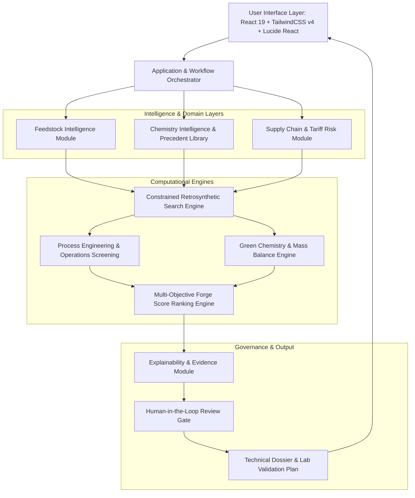

# Molecule Forge
### Refinery-to-Chemicals Opportunity Discovery and Sustainable Route-Screening Platform

[](https://vercel.com)
[](https://react.dev/)
[](https://www.typescriptlang.org/)
[](https://tailwindcss.com/)
[](#5-quantitative-scoring-model-and-mathematical-framework)
[](#10-risk-mitigation-governance-and-responsible-ai-positioning)

---

## Table of Contents

- [1. Executive Summary](#1-executive-summary)
- [2. The Industrial Problem Statement](#2-the-industrial-problem-statement)
- [3. The Proposed Solution: Five Analytical Pillars](#3-the-proposed-solution-five-analytical-pillars)
- [4. Operational Workflow](#4-operational-workflow)
- [5. Quantitative Scoring Model and Mathematical Framework](#5-quantitative-scoring-model-and-mathematical-framework)
  - [5.1 Multi-Attribute Forge Score Formulation](#51-multi-attribute-forge-score-formulation)
  - [5.2 Green Chemistry and Environmental Metrics](#52-green-chemistry-and-environmental-metrics)
- [6. Industrial Case Study: HMEL Bathinda Complex](#6-industrial-case-study-hmel-bathinda-complex)
  - [6.1 Feedstock Context](#61-feedstock-context)
  - [6.2 Downstream Valorization Scenario: Benzene to 4-H-3-MBN](#62-downstream-valorization-scenario-benzene-to-4-h-3-mbn)
  - [6.3 Multi-Route Trade-Off Evaluation Matrix](#63-multi-route-trade-off-evaluation-matrix)
- [7. System Architecture](#7-system-architecture)
- [8. Technology Stack and Implementation Details](#8-technology-stack-and-implementation-details)
- [9. Installation and Deployment Guide](#9-installation-and-deployment-guide)
  - [9.1 Local Development Environment](#91-local-development-environment)
  - [9.2 Production Deployment on Vercel](#92-production-deployment-on-vercel)
- [10. Risk Mitigation, Governance, and Responsible AI Positioning](#10-risk-mitigation-governance-and-responsible-ai-positioning)
- [11. Strategic Roadmap](#11-strategic-roadmap)
- [12. Engineering Team and Track Record](#12-engineering-team-and-track-record)

---

## 1. Executive Summary

**Molecule Forge** is an enterprise-grade, computer-aided process screening and chemical route-discovery platform. It enables integrated petroleum refineries and petrochemical complexes to transition from bulk commodity fuel producers into high-margin specialty chemical and pharmaceutical intermediate manufacturers.

By starting with available refinery aromatic cuts—including benzene, toluene, xylenes, and downstream phenol—the platform systematically generates, screens, and multi-objectively ranks retrosynthetic reaction pathways before capital-intensive laboratory validation is initiated.

```
       [ Refinery Aromatic Feedstock ]
         (Benzene / Toluene / Xylenes)
                       │
                       ▼
      ┌─────────────────────────────────┐
      │         MOLECULE FORGE          │  ◄── Rule-Based Retrosynthesis
      │      Core Screening Engine      │      + Techno-Economic Analysis (TEA)
      └────────────────┬────────────────┘      + Green Chemistry Matrix
                       │
         ┌─────────────┼─────────────┐
         ▼             ▼             ▼
   [ Route A ]    [ Route B ]   [ Route C ]
    Shortest     ★ Greenest      Domestic
    (3 Steps)     (Score: 81)   (92% Local)
         │             │             │
         └─────────────┼─────────────┘
                       ▼
      [ Actionable Experimental Validation Protocol ]
      (Risk Gates, Selectivity Targets, and Process Window)
```

> **Guiding Principle:** Molecule Forge serves as a deterministic decision-support instrument—analogous to a navigational engine for chemical engineering—allowing multidisciplinary teams to evaluate technical viability, capital costs, raw-material security, and environmental liabilities simultaneously.

---

## 2. The Industrial Problem Statement

Refinery operations generate abundant aromatic molecules alongside traditional transportation fuels. However, transforming these basic petrochemical intermediates into high-value specialty chemicals, Key Starting Materials (KSMs), or Active Pharmaceutical Ingredients (APIs) is hindered by severe cross-functional friction:

```
┌──────────────────┐       ┌──────────────────────┐       ┌──────────────────────┐
│  R&D / Chemistry │       │  Process Engineering │       │ Procurement / Supply │
│ Synthesizes route│ ───►  │ Identifies scale-up  │ ───►  │ Evaluates import     │
│ in the laboratory│       │ hazards & separations│       │ dependence & costs   │
└──────────────────┘       └──────────────────────┘       └──────────────────────┘
                                                                     │
                                                                     ▼
                                                          ┌──────────────────────┐
                                                          │ Business Development │
                                                          │ Screens margin       │
                                                          │ & market viability   │
                                                          └──────────────────────┘
```

### The Cost of Sequential Evaluation
In standard industrial workflows, prospective synthesis routes are evaluated in disconnected silos:
1. **Synthetic chemists** discover a chemically viable route, optimizing solely for reaction yield in milligram-scale glassware.
2. **Process engineers** subsequently identify that Step 2 requires cryogenic cooling (-20 °C) or hazardous high-pressure autogenous conditions (>40 bar), introducing prohibitive plant CAPEX.
3. **Procurement teams** discover that critical coupling reagents or specialized organometallic catalysts suffer from 90%+ overseas import dependencies.
4. **Environmental teams** calculate unacceptable waste factors (E-factor > 30), highlighting heavy-metal or cyanide effluent compliance barriers.

Consequently, research initiatives waste months of laboratory throughput investigating pathways that ultimately fail commercial, regulatory, or operational viability gates.

---

## 3. The Proposed Solution: Five Analytical Pillars

Molecule Forge breaks departmental silos by unifying chemistry, chemical engineering, procurement, and sustainability into five integrated software pillars:

| Pillar | Functional Scope | Industrial Value |
|---|---|---|
| **I. Feedstock Intelligence Layer** | Digital mapping of refinery aromatics (benzene, toluene, xylenes), secondary streams (hexane, sulfur), and functional handles. | Connects captive refinery streams directly to addressable commercial product portfolios. |
| **II. Target-Product & Retrosynthesis** | Dual-mode pathway exploration: Feedstock-First (diversification) and Target-First (import substitution). | Identifies non-obvious disconnections while eliminating ungrounded generative chemistry hallucinations. |
| **III. Green Chemistry Screening** | Algorithmic calculation of E-Factor, Process Mass Intensity (PMI), Atom Economy, and solvent environmental hazards. | Eliminates regulatory and effluent liabilities prior to experimental synthesis. |
| **IV. SCM & Commercial Feasibility** | Multi-attribute assessment of domestic supplier availability, catalog pricing, and raw-material vulnerability. | Protects planned operational units from geopolitical dependencies and supply-chain shocks. |
| **V. Explainable Decision Governance** | Multi-criteria optimization resulting in a unified **Forge Score**, accompanied by transparent uncertainty profiles. | Provides chemists, engineering leads, and executive sponsors with audited technical rationale. |

---

## 4. Operational Workflow

```
                                  OPERATIONAL INPUT MODES
                 ┌─────────────────────────────────────────────────────────┐
                 │                                                         │
Feedstock-First  ──► Select Refinery Cut (Benzene, Phenol, Xylenes)         │
                 │   Apply Operational Constraints (Max Steps, Solvents)   │
                 │                                                         │
Target-First     ──► Supply Target Molecule (SMILES / CAS / Nomenclature)  │
                 │   Decompose Retrosynthetically to Captive Feeds         │
                 └────────────────────────────┬────────────────────────────┘
                                              │
                                              ▼
                             AI-ASSISTED RETROSYNTHESIS ENGINE
                         (Curated Templates + Precedent Validation)
                                              │
                                              ▼
                                 MULTI-CRITERIA EVALUATION
                 ┌─────────────────────────────────────────────────────────┐
                 │ Technical: Transformation count, isolation stages       │
                 │ Economic: Raw-material index, yield-adjusted cost/kg    │
                 │ Environmental: E-Factor, PMI, solvent hazard profile    │
                 │ Supply Chain: Domestic availability index (% local)     │
                 │ Process: Temperature/pressure envelope, unit operations │
                 └────────────────────────────┬────────────────────────────┘
                                              │
                                              ▼
                                   THE FORGE SCORE ENGINE
                                (Pareto-Optimized Decision)
                                              │
                                              ▼
                                ACTIONABLE VALIDATION DOSSIER
                             (Experimental Plan & Risk Gateways)
```

1. **Input Ingestion:** The user designates either a captive feedstock stream or enters an existing specialty chemical target via SMILES, CAS, or molecular structure.
2. **Constrained Exploration:** Retrosynthetic graph expansion generates candidate reaction networks governed by user-defined process boundaries (e.g., maximum four transformations, exclusion of halogenated solvents, preference for atmospheric operations).
3. **Parallel Attribute Screening:** Candidate routes are simultaneously evaluated across technical, economic, environmental, and supply-chain domains.
4. **Pareto Ranking:** Routes are ranked using the multi-attribute Forge Score, surfacing the exact trade-offs between shortest, greenest, and most cost-effective alternatives.
5. **Dossier Generation:** The system synthesizes an experimental validation dossier detailing target conversion rates, primary risk gates, and analytical protocols.

---

## 5. Quantitative Scoring Model and Mathematical Framework

### 5.1 Multi-Attribute Forge Score Formulation
Candidate synthetic routes receive a normalized, multi-attribute index ($F \in [0, 100]$) calibrated according to corporate and operational priorities:

$$F = w_T T + w_E E + w_G G + w_A A + w_S S + w_D D$$

Subject to the normalization condition:

$$\sum_{i \in \{T, E, G, A, S, D\}} w_i = 1.0$$

Where:
* **$T$ (Technical Feasibility - 25%):** Number of synthetic transformations, precedent robustness, predicted intermediate stability, and functional-group compatibility.
* **$E$ (Economic Attractiveness - 20%):** Stoichiometric raw-material costs, catalyst expenses, and yield-adjusted cost per kilogram.
* **$G$ (Green Chemistry Performance - 20%):** Waste metrics, solvent recovery potential, and regulatory hazard classifications.
* **$A$ (Raw-Material Availability - 15%):** Domestic sourcing ratio, supplier count, and geographic import reliance.
* **$S$ (Scale-Up and Process Suitability - 10%):** Absence of extreme process conditions ($T < -15^\circ\text{C}$ or $P > 15\text{ bar}$), crystallization feasibility versus fractional distillation burdens.
* **$D$ (Data Confidence - 10%):** Ratio of peer-reviewed experimental literature precedents versus interpolated predictive data.

---

### 5.2 Green Chemistry and Environmental Metrics

#### Environmental Factor (E-Factor)
Quantifies total waste generated relative to isolated product output:

$$\text{E-Factor} = \frac{\sum m_{\text{waste}}}{m_{\text{product}}} = \frac{m_{\text{reactants}} + m_{\text{solvents}} + m_{\text{reagents}} - m_{\text{product}}}{m_{\text{product}}}$$

*Target threshold for specialty intermediates: $\text{E-Factor} \le 10$ (unoptimized industrial pathways frequently exceed $25 - 50$).*

#### Process Mass Intensity (PMI)
Measures the absolute mass utilization efficiency within defined system boundaries:

$$\text{PMI} = \frac{\sum m_{\text{input}}}{m_{\text{product}}}$$

#### Atom Economy (AE)
Evaluates theoretical incorporation of reactant mass into the desired molecular structure:

$$\text{Atom Economy (\%)} = \left( \frac{\text{Molecular Weight of Target Product}}{\sum \text{Molecular Weight of Stoichiometric Reactants}} \right) \times 100$$

#### Solvent Safety Index and Process Intensity
* **Solvent Classification:** Categorizes reaction media based on the ACS Green Chemistry Institute (ACS-GCI) solvent selection guidelines, prioritizing recyclable solvents (e.g., dimethyl carbonate, 2-MeTHF, water) over hazardous chlorinated hydrocarbons.
* **Thermal & Pressure Envelopes:** Flags thermal regimes requiring high-pressure steam (>180 °C) or cryogenic refrigeration (< -10 °C), directly reducing utility demands.

---

## 6. Industrial Case Study: HMEL Bathinda Complex

### 6.1 Feedstock Context
The **HPCL-Mittal Energy Limited (HMEL)** integrated refinery-petrochemical complex in Bathinda, Punjab, represents a major domestic petrochemical infrastructure asset:
* **11.3 MMTPA** Crude Refining Capacity
* **1.2 MMTPA** Multi-Feed Cracker Unit
* World-scale Polyethylene (PE) and Polypropylene (PP) manufacturing
* Captive aromatic and specialty streams: high-purity **Benzene**, **Hexane**, **Sulfur**, and **Carbon Black Feedstock (CBFS)**

```
┌────────────────────────────────────────────────────────────────────────┐
│                   HMEL REFINERY-PETROCHEMICAL COMPLEX                  │
├────────────────────┬────────────────────┬──────────────────────────────┤
│ Refinery Stream    │ Baseline Utility   │ Molecule Forge Value Ladder  │
├────────────────────┼────────────────────┼──────────────────────────────┤
│ Benzene            │ Bulk Commodity     │ Pharma KSMs & Agrochemicals  │
│ Phenol (Downstream)│ Resins / Bulk      │ High-Performance Additives   │
│ Hexane             │ Industrial Solvent │ High-Purity Extraction Media │
│ Sulfur             │ Bulk Fertilizer    │ Vulcanization Intermediates  │
│ CBFS               │ Carbon Black Feed  │ Specialized Conductive Mats  │
└────────────────────┴────────────────────┴──────────────────────────────┘
```

---

### 6.2 Downstream Valorization Scenario: Benzene to 4-H-3-MBN
* **Objective:** Produce high-purity **4-Hydroxy-3-methylbenzonitrile (4-H-3-MBN)**, an essential intermediate for agrochemical active ingredients.
* **Constraints:** Maximum four chemical transformations, domestic raw-material availability $\ge 70\%$, avoidance of cyanide-bearing effluent streams.

### 6.3 Multi-Route Trade-Off Evaluation Matrix

| Criterion | Route A: Shortest Pathway | Route B: Green / Sustainable (★ Selected) | Route C: Domestic Sourcing |
|---|---|---|---|
| **Synthetic Step Count** | **3 Transformations** | 4 Transformations | 4 Transformations |
| **Feedstock Precursor** | Benzene (99.8%) | Benzene (99.8%) | Benzene (99.8%) |
| **Technical Feasibility ($T$)** | 84 / 100 | 76 / 100 | 71 / 100 |
| **Raw Material Cost Index** | ₹395 / kg | ₹428 / kg | ₹465 / kg |
| **Green Chemistry Score ($G$)** | 67 / 100 | **91 / 100** | 78 / 100 |
| **Environmental E-Factor** | 16.4 kg waste / kg | **8.4 kg waste / kg (-49%)** | 12.1 kg waste / kg |
| **Effluent Hazard Profile** | High (Cyanide intermediate) | **Benign (Aqueous salt / DMC)** | Moderate |
| **Domestic Sourcing ($A$)** | 62% | 75% | **92%** |
| **Scale-Up Operating Envelope**| Cryogenic stage (-15 °C) | **Atmospheric / Low-steam (<90 °C)**| High pressure (25 bar) |
| **Data Confidence ($D$)** | 86 / 100 | 74 / 100 | 69 / 100 |
| **Overall Forge Score** | **77.0 / 100** | **81.0 / 100 (RECOMMENDED)** | **78.0 / 100** |

> **Automated Recommendation Rationale:**
> *Route B is prioritized for experimental validation. While Route A requires one fewer transformation, Route B reduces E-factor waste by 49%, avoids severe cyanide regulatory liabilities, operates within a standard low-pressure utility envelope, and provides stable unit economics (₹428/kg vs ₹395/kg). Primary laboratory risk gate: validate Step 3 catalytic oxidation selectivity.*

---

## 7. System Architecture



---

## 8. Technology Stack and Implementation Details

* **Client Presentation Layer:** React 19, TypeScript 7.0, Vite 8.3, TailwindCSS v4, Lucide React, Motion.
* **Cheminformatics Foundations:** SMILES notation parsers, curated transformation templates, substructure similarity indexing.
* **Process Simulation & Evaluation:** Algorithmic E-Factor calculators, stoichiometric mass-balance models, solvent classification tables.
* **Deployment & Infrastructure:** Vercel edge deployment with client-side SPA routing (`vercel.json`) and deterministic dependency management (`.npmrc` with `legacy-peer-deps`).

---

## 9. Installation and Deployment Guide

### 9.1 Local Development Environment

Ensure [Node.js](https://nodejs.org/) (version 20.11+ or 22+) and `npm` are installed.

```bash
# Clone the repository
git clone https://github.com/rautsiddharth82-crypto/Molecule-Forge.git
cd Molecule-Forge

# Install dependencies deterministically
npm install

# Launch development server
npm run dev

# Execute static type analysis
npm run lint

# Build optimized production bundle
npm run build
```

### 9.2 Production Deployment on Vercel

The repository is pre-configured with root-level `vercel.json` and `.vercelignore` files:
1. Import the repository into the **Vercel Dashboard**.
2. Vercel automatically selects the **Vite** preset, executes `npm run build`, and routes all incoming requests through `dist/index.html`.
3. To deploy directly via the command line:
   ```bash
   npx vercel --prod
   ```

---

## 10. Risk Mitigation, Governance, and Responsible AI Positioning

| Operational Risk | Engineered Mitigation |
|---|---|
| **Synthetic Hallucination** | System enforces template-constrained reaction rules and validated precedents; unconstrained generative language models are prohibited from proposing chemical bonds. |
| **Incomplete Scientific Literature** | Each reaction step presents a confidence score and isolates verified literature records from predictive estimates. |
| **Impractical Cost Expectations** | Techno-economic projections are clearly categorized as preliminary sensitivity scenarios with user-tunable feedstock price inputs. |
| **Process Safety Incidents** | Automated flags highlight exothermic risks, toxic classification intermediates, and extreme pressure/temperature conditions. |
| **Intellectual Property Infringement**| Provenance tracking provides direct literature references to publicly accessible patent and academic citations. |

> **Mandatory Disclaimer:** Molecule Forge is a digital decision-support tool, not an autonomous synthesis engine. Predicted yields and reaction conditions constitute screening hypotheses that require verification by qualified chemists prior to pilot scale-up.

---

## 11. Strategic Roadmap

* **Phase 1: Proof of Concept (Current):** Interactive multi-criteria screening dashboard for benzene, phenol, toluene, and xylene pathways with green chemistry metrics and validation plan outputs.
* **Phase 2: Industrial Pilot:** Direct ingestion of HMEL Bathinda crude assay and stream compositions; dynamic local chemical supplier pricing feeds; integration of local RDKit cheminformatics pipelines.
* **Phase 3: Enterprise Integration:** Bi-directional integration with Laboratory Information Management Systems (LIMS) and Enterprise Resource Planning (ERP) software, enabling continuous calibration as experimental validation runs are logged.

---

## 12. Engineering Team and Track Record

### Core Contributors

* **Siddharth Raut** — *Team Lead & UI/UX Designer*
  * Platform architecture, user experience design, and end-to-end product implementation.
* **Abhyuday Jain** — *Domain & Chemistry Researcher*
  * Chemical route validation, reaction template curation, and green chemistry metric modeling.
* **Hardik Mathur** — *Backend & Systems Engineer*
  * Process feasibility logic, data structures, and mathematical scoring algorithms.

### Competitive Track Record
* **3rd Rank (National Finalist)** — **Punjab & Sind Bank (PSB) Hackathon / Bank of Baroda (BOB) Hackathon**
* **3rd Rank (National Finalist)** — **NIT Raipur Codeutsava National Hackathon**
